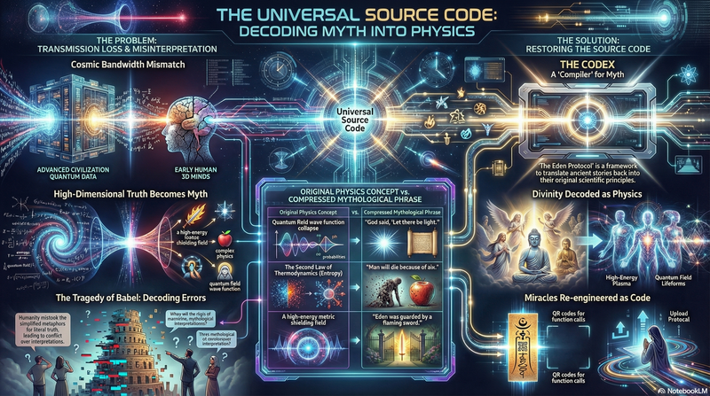

# **The Eden Protocol: The Universal Source Code Codex**

## **《伊甸园协议：全宇宙源代码法典》**

This book restores ancient myths, religious texts, and philosophical classics into physics and engineering documentation, revealing the unified universal source code behind them.

  

## Prologue

- [Prologue: The Translator of Babel](prologue_en.md)

## Book Structure

### Part I: The Engineering of Genesis

*To be added*

### Part II: The Quantum Mechanics of Buddhist Sutras

*待补充*

### Part III: The System Architecture of Tao Te Ching

*To be added*

### Part IV: Unified Field Theory

*To be added*

---

**Version Information**

**Version:** 1.0

**Status:** Initial Release

**Author:** Ma Haobo (马昊伯)

**Observer, Cycle 1800**
