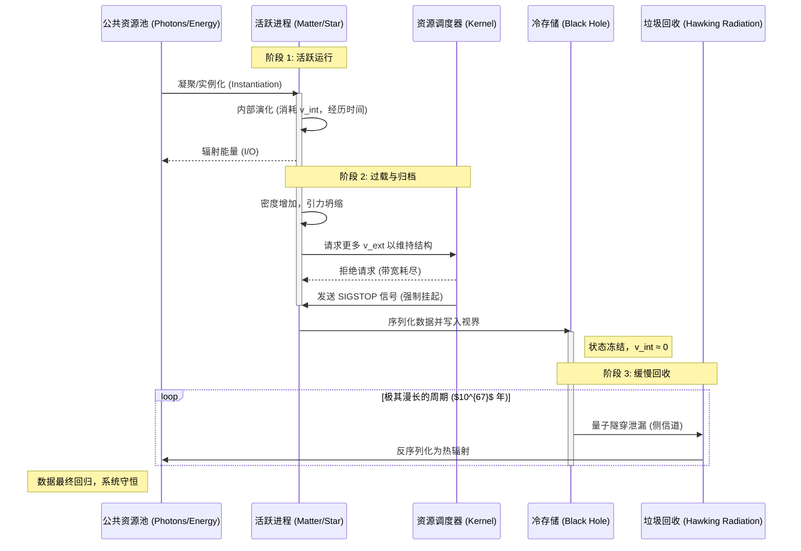

# 附录 E.1：宇宙内核架构图 (Appendix E.1: The Universe Kernel Architecture Diagram)

**—— 代号: "The Matrix" (v1.1)**

**"如果我们把这一整套理论（FS-QCA 架构）看作一个真实的操作系统软件，那么画出它的系统架构图 (System Architecture Diagram) 是最清晰的总结方式。"**

---

我们将从三个不同的视图来构建这个架构：

1.  **宏观层：** 核心组件与资源流向图 (Component & Resource Flow)

2.  **微观层：** 底层硬件抽象图 (Hardware Abstraction Layer)

3.  **流程层：** 数据生命周期图 (Data Lifecycle Flow)

---

## 视图 1：宏观组件与资源流向 (Macro Component & Resource Flow)

这张图展示了宇宙主要的"功能模块"以及核心资源（带宽 $c_{FS}$）是如何在它们之间分配的。

```mermaid
graph TD

    %% --- 核心定义 ---

    subgraph Kernel["系统内核 (System Kernel)"]

        style Kernel fill:#f9f,stroke:#333,stroke-width:4px

        MasterClock[("总线时钟 (Master Clock)\nc_FS Bandwidth")]

        Scheduler{"资源调度器 (Scheduler)\n[预算方程]"}

    end


    %% --- 存储层 ---

    subgraph StorageTier["存储分层 (Storage Tier)"]

        style StorageTier fill:#ccf,stroke:#333,stroke-width:2px

        RAM[("一级缓存 (RAM)\n活跃物质/生命")]

        ColdStorage[("冷存储 (Cold Archive)\n黑洞/视界")]

    end


    %% --- 网络层 ---

    subgraph NetworkLayer["网络层 (Network Layer)"]

        style NetworkLayer fill:#cfc,stroke:#333,stroke-width:2px

        DataPackets(无状态数据包\n光子)

        Router("路由网关 (Router)\n时空几何")

    end


    %% --- 后台服务 ---

    subgraph BackgroundServices["后台服务 (Background Services)"]

        style BackgroundServices fill:#ff9,stroke:#333,stroke-width:2px

        Logger(日志记录器\n熵/纠缠扩散)

        GC(垃圾回收器 GC\n霍金辐射)

    end


    %% --- 核心流程连接 ---


    MasterClock ==>|提供总带宽| Scheduler


    Scheduler ==>"分配 v_int (算力)"==> RAM

    Scheduler ==>"分配 v_ext (I/O)"==> DataPackets

    Scheduler --"强制挂起\n(v_int → 0)"--> ColdStorage


    RAM --"产生数据流"--> DataPackets

    RAM --"高密度触发归档"--> ColdStorage


    DataPackets --"经过"--> Router

    ColdStorage --"增加路由开销\n(引力透镜)"--> Router


    RAM -.-"写入"-> Logger

    ColdStorage -.-"慢速释放"-> GC

    GC -.-"回归"-> DataPackets


    %% --- 样式定义 ---

    classDef critical fill:#f00,stroke:#333,stroke-width:2px,color:#fff;

    %% 如果某个节点过载，可以标记为 critical
```

### **图解说明：**

1.  **核心 (Kernel)：** 宇宙的心脏是**总线时钟 ($c_{FS}$)**。它向**资源调度器**提供恒定的带宽。调度器依据"广义帕塞瓦尔恒等式"决定谁获得多少资源。

2.  **存储 (Storage)：**

     * **RAM：** 你、我、恒星。我们拥有高 $v_{int}$，正在活跃地进行计算（经历时间）。

     * **冷存储：** 黑洞。当 RAM 区域密度过高，被调度器强制挂起，数据序列化存储在视界表面。

3.  **网络 (Network)：** 光子是无状态的数据包，满带宽传输。**路由器**（时空）负责引导它们。当冷存储（黑洞）存在时，路由表的复杂度和开销增加（引力）。

4.  **后台 (Background)：**

     * **日志：** 所有的交互都会留下纠缠痕迹，导致熵增。

     * **GC：** 霍金辐射缓慢地将冷存储的数据清洗回网络层。

---

## 视图 2：底层硬件抽象 (Micro Hardware Abstraction Layer)

这张图深入到"普朗克尺度"，展示了支撑上述宏观功能的底层"电路"。

```mermaid
graph LR

    subgraph PhysicalSubstrate["物理基质 (Physical Substrate)"]

        style PhysicalSubstrate fill:#eee,stroke:#333,stroke-width:2px

        QCA_Grid[("QCA 晶格网络 (QCA Grid)\n离散寻址空间")]

    end


    subgraph ExecutionEngine["执行引擎 (Execution Engine)"]

        style ExecutionEngine fill:#ddd,stroke:#333,stroke-width:2px

        UnitaryOp{"幺正演化算符 (U)\n底层逻辑门"}

    end


    subgraph InterfaceLayer["接口层 (Interface Layer)"]

        style InterfaceLayer fill:#ccc,stroke:#333,stroke-width:2px

        FS_Geometry("FS 几何接口 (FS Geometry)\n宏观投影视图")

    end


    %% 连接

    QCA_Grid ==>|提供状态向量 Psi_n| UnitaryOp

    UnitaryOp ==>|执行状态更新 Psi_n+1| QCA_Grid

    QCA_Grid -.->|投影/粗粒化| FS_Geometry


    %% 注释

    note1[因果速度限制 v_LR <br> 由晶格拓扑决定]

    note2[连续时空是一种 <br> "用户界面幻觉"]


    QCA_Grid --- note1

    FS_Geometry --- note2
```

### **图解说明：**

  * 宇宙不是连续的流体，而是一个巨大的、离散的 **QCA 晶格（量子比特阵列）**。

  * 所有的物理定律，在底层都只是一个简单的**幺正算符 $U$** 对这个晶格的反复迭代更新。

  * 我们看到的光滑的"时空几何"，只是这个底层离散网络的**宏观投影（UI 界面）**。

---

## 视图 3：数据生命周期流 (Data Lifecycle Flowchart)

这张图展示了一个"数据块"（比如一颗恒星）在宇宙系统中的典型生命周期。



### **图解说明：**

这个流程清晰地展示了我们理论中的核心观点：

  * 物质是活跃的 RAM。

  * 黑洞是因资源耗尽而被强制生成的 Archive。

  * 霍金辐射是保障系统最终一致性的 GC 机制。

---

## **架构师总结**

这一套图表构成了《The Matrix: Source Code of the Universe》的技术核心。它将抽象、复杂的物理学概念，成功地转化为了一套逻辑自洽的**计算机系统工程语言**。

对于任何想要理解或扩展这个宇宙模型的"开发者"来说，这套架构图就是他们的**蓝图**。

