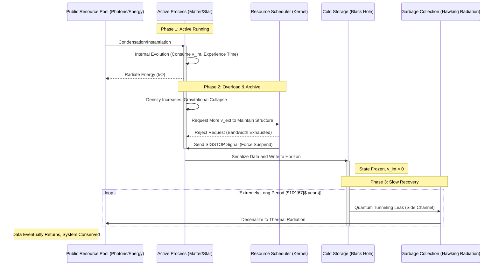

# Appendix E.1: The Universe Kernel Architecture Diagram

**—— Codename: "The Matrix" (v1.1)**

**"If we view this entire theory (FS-QCA architecture) as a real operating system software, then drawing its System Architecture Diagram is the clearest way to summarize it."**

---

We will construct this architecture from three different views:

1.  **Macro Layer:** Core Components & Resource Flow Diagram

2.  **Micro Layer:** Hardware Abstraction Layer Diagram

3.  **Process Layer:** Data Lifecycle Flow Diagram

---

## View 1: Macro Component & Resource Flow

This diagram shows the universe's main "functional modules" and how core resources (bandwidth $c_{FS}$) are allocated among them.

```mermaid
graph TD

    %% --- Core Definitions ---

    subgraph Kernel["System Kernel"]

        style Kernel fill:#f9f,stroke:#333,stroke-width:4px

        MasterClock[("Master Clock\nc_FS Bandwidth")]

        Scheduler{"Resource Scheduler\n[Budget Equation]"}

    end


    %% --- Storage Tier ---

    subgraph StorageTier["Storage Tier"]

        style StorageTier fill:#ccf,stroke:#333,stroke-width:2px

        RAM[("RAM\nActive Matter/Life")]

        ColdStorage[("Cold Archive\nBlack Hole/Horizon")]

    end


    %% --- Network Layer ---

    subgraph NetworkLayer["Network Layer"]

        style NetworkLayer fill:#cfc,stroke:#333,stroke-width:2px

        DataPackets(Stateless Packets\nPhotons)

        Router("Router Gateway\nSpacetime Geometry")

    end


    %% --- Background Services ---

    subgraph BackgroundServices["Background Services"]

        style BackgroundServices fill:#ff9,stroke:#333,stroke-width:2px

        Logger(Logger\nEntropy/Entanglement Diffusion)

        GC(Garbage Collector GC\nHawking Radiation)

    end


    %% --- Core Flow Connections ---


    MasterClock ==>|Provide Total Bandwidth| Scheduler


    Scheduler ==>"Allocate v_int (Compute)"==> RAM

    Scheduler ==>"Allocate v_ext (I/O)"==> DataPackets

    Scheduler --"Force Suspend\n(v_int → 0)"--> ColdStorage


    RAM --"Generate Data Flow"--> DataPackets

    RAM --"High Density Triggers Archive"--> ColdStorage


    DataPackets --"Pass Through"--> Router

    ColdStorage --"Increase Routing Overhead\n(Gravitational Lensing)"--> Router


    RAM -.-"Write"-> Logger

    ColdStorage -.-"Slow Release"-> GC

    GC -.-"Return"-> DataPackets


    %% --- Style Definitions ---

    classDef critical fill:#f00,stroke:#333,stroke-width:2px,color:#fff;

    %% If a node is overloaded, it can be marked as critical
```

### **Diagram Explanation:**

1.  **Kernel:** The heart of the universe is the **Master Clock ($c_{FS}$)**. It provides constant bandwidth to the **Resource Scheduler**. The scheduler decides who gets how much resource based on the "Generalized Parseval Identity."

2.  **Storage:**

     * **RAM:** You, me, stars. We have high $v_{int}$ and are actively computing (experiencing time).

     * **Cold Storage:** Black holes. When RAM regions become too dense, they are forcibly suspended by the scheduler, and data is serialized and stored on the horizon surface.

3.  **Network:** Photons are stateless data packets transmitting at full bandwidth. The **Router** (spacetime) guides them. When cold storage (black holes) exists, routing table complexity and overhead increase (gravity).

4.  **Background:**

     * **Logger:** All interactions leave entanglement traces, causing entropy increase.

     * **GC:** Hawking radiation slowly cleans cold storage data back to the network layer.

---

## View 2: Micro Hardware Abstraction Layer

This diagram delves into the "Planck scale," showing the underlying "circuits" that support the above macro functions.

```mermaid
graph LR

    subgraph PhysicalSubstrate["Physical Substrate"]

        style PhysicalSubstrate fill:#eee,stroke:#333,stroke-width:2px

        QCA_Grid[("QCA Lattice Network\nDiscrete Address Space")]

    end


    subgraph ExecutionEngine["Execution Engine"]

        style ExecutionEngine fill:#ddd,stroke:#333,stroke-width:2px

        UnitaryOp{"Unitary Evolution Operator (U)\nUnderlying Logic Gates"}

    end


    subgraph InterfaceLayer["Interface Layer"]

        style InterfaceLayer fill:#ccc,stroke:#333,stroke-width:2px

        FS_Geometry("FS Geometry Interface\nMacroscopic Projection View")

    end


    %% Connections

    QCA_Grid ==>|Provide State Vector Psi_n| UnitaryOp

    UnitaryOp ==>|Execute State Update Psi_n+1| QCA_Grid

    QCA_Grid -.->|Project/Coarse-grain| FS_Geometry


    %% Notes

    note1[Causal Speed Limit v_LR <br> Determined by Lattice Topology]

    note2[Continuous Spacetime is a <br> "User Interface Illusion"]


    QCA_Grid --- note1

    FS_Geometry --- note2
```

### **Diagram Explanation:**

  * The universe is not a continuous fluid, but a massive, discrete **QCA lattice (quantum bit array)**.

  * All physical laws, at the bottom layer, are just a simple **unitary operator $U$** repeatedly iterating updates on this lattice.

  * The smooth "spacetime geometry" we see is just a **macroscopic projection (UI interface)** of this underlying discrete network.

---

## View 3: Data Lifecycle Flowchart

This diagram shows the typical lifecycle of a "data block" (such as a star) in the universe system.



### **Diagram Explanation:**

This flow clearly demonstrates the core viewpoints of our theory:

  * Matter is active RAM.

  * Black holes are Archives forcibly generated due to resource exhaustion.

  * Hawking radiation is the GC mechanism ensuring eventual system consistency.

---

## **The Architect's Summary**

This set of diagrams constitutes the technical core of "The Matrix: Source Code of the Universe." It successfully transforms abstract, complex physics concepts into a logically self-consistent **computer systems engineering language**.

For any "developer" who wants to understand or extend this universe model, this architecture diagram is their **blueprint**.

